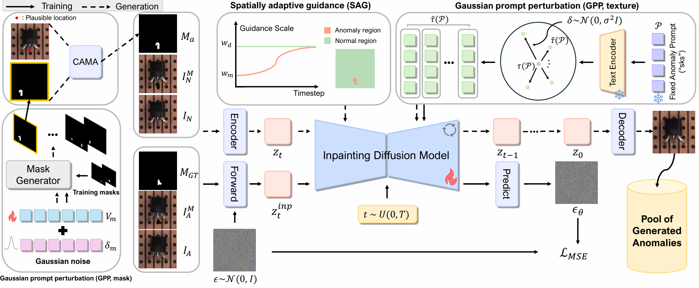

# MAGIC: Few-Shot Mask-Guided Anomaly Inpainting with Prompt Perturbation, Spatially Adaptive Guidance, and Context Awareness

[](https://arxiv.org/abs/2507.02314)

## Abstract

Few-shot anomaly generation is a key challenge in industrial quality control. Although diffusion models are promising, existing methods struggle: global prompt-guided approaches corrupt normal regions, and existing inpainting-based methods often lack the in-distribution diversity essential for robust downstream models. We propose MAGIC, a fine-tuned inpainting framework that generates high-fidelity anomalies that strictly adhere to the mask while maximizing this diversity. MAGIC introduces three complementary components: (i) Gaussian prompt perturbation, which prevents model overfitting in the few-shot setting by learning and sampling from a smooth manifold of realistic anomalies, (ii) spatially adaptive guidance that applies distinct guidance strengths to the anomaly and background regions, and (iii) context-aware mask alignment to relocate masks for plausible placement within the host object. Under consistent identical evaluation protocol, MAGIC outperforms state-of-the-art methods on diverse anomaly datasets in downstream tasks.

<p align="center">
  
</p>

## 🔧 Environment Setup (Main Inpainting Model)

This environment is used for training and inference of our **Stable Diffusion Inpainting-based anomaly generation model**.

1. Create and activate the conda environment:
```bash
conda create -n magic python=3.9
conda activate magic
```

2. Install CUDA and PyTorch:
```bash
conda install -c conda-forge cudatoolkit=11.8
pip install torch torchvision torchaudio --index-url https://download.pytorch.org/whl/cu118 --upgrade
```

3. Install other dependencies:
```bash
pip install -r requirements.txt
pip install opencv-python
```

## 📦 Data Preparation

### ✅ 1. Download MVTec AD Dataset
Download from: https://www.mvtec.com/company/research/datasets/mvtec-ad  
Extract it to a target directory and use the path when running training or inference.

### ✅ 2. Generate Foreground Masks using U-2-Net
- **Source:** https://github.com/xuebinqin/U-2-Net  
- **License:** Apache License 2.0

This model is used to extract **foreground masks** from normal images.
Save the generated mask as:
```
<dataset_root>/<category>/train/good/<image_filename>_mask.png
```
Example:
```
mvtec_ad/screw/train/good/000.png → obj_foreground_mask/screw/train/good/000_mask.png
```

---

## 🔍 Semantic Matching (GeoAware-SC, for CAMA)

GeoAware-SC is used to compute **keypoint matches between normal and defective images**, and is required for our CAMA module.
> ⚠️ This runs in a **separate environment** from the inpainting model.

- **Source:** https://github.com/Junyi42/GeoAware-SC  
- **License:** Not specified (assumed all rights reserved)

### 🔧 Setup Instructions:

1. Clone GeoAware-SC:
```bash
git clone https://github.com/Junyi42/GeoAware-SC.git
```

2. Add the Matching Script

Move the `CAMA_matching.py` file into the cloned folder:

```
GeoAware-SC/CAMA_matching.py
```

Example command:

```bash
mv CAMA_matching.py GeoAware-SC/CAMA_matching.py
```


3. Follow GeoAware-SC setup guide (e.g., install dependencies).

4. Run the following to generate `matching_result.json`:
```bash
python CAMA_matching.py \
  --mvtecad_dir /path/to/mvtec_ad \
  --categories screw \
  --img_size 480 \
  --out_dir /path/to/matching_output \
  --mask_root /path/to/obj_foreground_mask
```

> Replace `screw` with the desired category name.  
The resulting `matching_result.json` file will be saved inside the specified `--out_dir` folder, and is required for inference.
---

## 🚀 Training & Inference (Example Category: screw)

### ✅ Training
To train on the screw category:
```bash
python run_train.py \
  --base_dir /path/to/mvtec_ad \
  --output_name output_name \
  --text_noise_scale 1.0 \
  --category screw
```

> Replace `screw` with any other category name from MVTec AD.
### ✅ Inference
To run inference with trained checkpoints:
```bash
python inference.py \
  --model_ckpt_root /path/to/trained/ckpt \
  --categories screw \
  --dataset_type mvtec \
  --text_noise_scale 1.0 \
  --defect_json /path/to/defect_classification.json \
  --match_json /path/to/matching_result.json \
  --normal_masks /obj_foreground_mask \
  --gsi_use_schedule \
  --mask_dir /anomaly_mask \
  --gsi_schedule cosine \
  --gsi_min 4.0 \
  --gsi_max 7.5 \
  --guidance_scale_outside 7.5 \
  --CAMA \
  --base_dir /path/to/mvtec_ad \
```

---

## 🧪 Evaluation

This repository provides four evaluation scripts to assess the quality and diversity of generated anomaly images.

### 1. **KID Evaluation** (`cal_kid.py`)

```bash
python cal_kid.py --real_path=/path/to/mvtec_ad --generated_path=/path/to/generated_images
```

### 2. **IC-LPIPS Evaluation** (`cal_ic_lpips.py`)

```bash
python cal_ic_lpips.py --mvtec_path=/path/to/mvtec_ad --gen_path=/path/to/generated_images
```

### 3. **Classification Training** (`train-classification.py`)


```bash
python train-classification.py \
  --mvtec_path=/path/to/mvtec_ad \
  --generated_data_path=/path/to/generated_images \
  --checkpoint_path=/path/to/save_checkpoints
```

### 4. **Classification Testing** (`test-classification.py`)

```bash
python test-classification.py \
  --mvtec_path=/path/to/mvtec_ad \
  --generated_data_path=/path/to/generated_images \
  --checkpoint_path=/path/to/save_checkpoints
```

> All scripts are located under the `evaluation/` directory. Replace each path with the appropriate location of your data or checkpoints.


## 📁 License Files

See the `licenses/` folder:
- `CREATIVEML-OPEN-RAIL-M.txt` — Stable Diffusion v2  
- `GEOAWARE-NOTICE.txt` — GeoAware-SC (no license specified)  
- `LICENSE_U2NET.txt` — U-2-Net (Apache 2.0)


## 📄 License

This code is licensed for **academic research and non-commercial use only**.

- You may use, modify, and distribute this code **for academic or educational purposes**.
- **Commercial use is strictly prohibited** without explicit written permission from the authors.
- If you use this code in your research, please cite our paper.
- This work is licensed under the Creative Commons Attribution-NonCommercial 4.0 International (CC BY-NC 4.0) License. See https://creativecommons.org/licenses/by-nc/4.0/ for details.

© Jae Hyuck Choi, 2025


